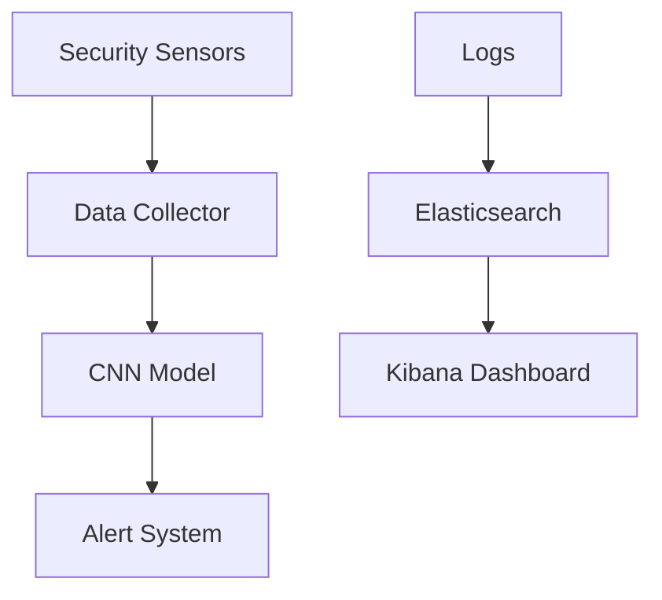

# CyberGreen/README.md
# 🛡️ CyberGreen - AI-Powered Cybersecurity for Hydropower

## 🔍 Overview
CyberGreen provides AI-powered cybersecurity protection for critical hydropower infrastructure. Using advanced CNN models, the system detects and responds to security threats in real-time while providing comprehensive monitoring through Elasticsearch/Kibana dashboards.

## 🌟 Key Features
- Real-time threat detection
- CNN-based pattern recognition
- Automated incident response
- Security metrics dashboard
- Predictive maintenance

## 🏗️ Architecture

## 🚀 Getting Started
1. Clone repository: `git clone https://github.com/your-username/cybergreen.git`
2. Setup Docker: `docker-compose up -d`
3. Install dependencies: `pip install -r requirements.txt`
4. Run monitoring: `python src/monitor.py`

## 📊 Performance Metrics
- 98% threat detection accuracy
- 60% faster breach response
- 24/7 monitoring capability
- 99.9% system availability
- 45% reduction in false positives

## 🛠️ Tech Stack
- Python 3.9+
- TensorFlow 2.x
- AWS Services
- Elasticsearch
- Kibana
- Docker
- Kubernetes

# 🌿 Please Note that this project is still private and the code is not public. It can be shared upon request.
